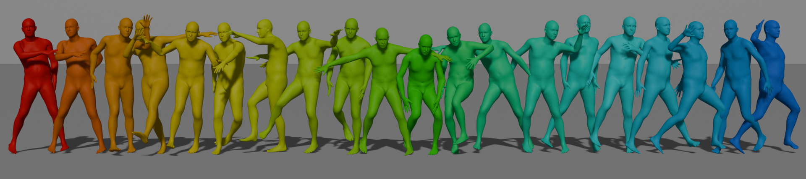

<h1 align="center">
DanceFusion
</h1>

<h3 align="center"> This repository contains official code for our research paper "Rethinking Sampling Strategies for Long-Term Dance Generation with Diffusion Model".</h3>


---

## 📍 Environment setup

Our environment is similar to [EDGE](https://github.com/Stanford-TML/EDGE). You may check them for more details.

```
pytorch==2.3.0
```
## 🔮 Data preparation

You can download the AIST++ dataset from [EDGE repo](https://github.com/Stanford-TML/EDGE). Specificall, it is at [google drive](https://drive.google.com/file/d/1RzqSbSnbMEwLUagV0GThfpm9JJXePGkV/view?usp=sharing).  After downloading, put it in the `data_loaders\\d2m\\` folder.

Process the AIST++ dataset using the following commands:

```
cd data_loaders\d2m\
python create_dataset.py --extract-baseline --extract-jukebox --datapath [DATA_DIR]
```

## 🚀 Pretrained weights
We provide the pretrained models here: [pretrained models](https://drive.google.com/file/d/1fsjaW87fXvaFQDBQxdCh9dO4ineCi9ln/view?usp=sharing). It contains the pretrained model and training configurations used to report metrics in our paper. You can put the pretrained model and training configuration file under `[CHECKPOINT_DIR]`.

## 💻 Training
Once the AIST++ dataset is downloaded and processed, run the training script:

```
python train_diffusion.py --save_dir [CHECKPOINT DIR]
```

If you decide to use baseline feature extracted from Librosa library, change `jukebox_feats_sliced` into `music_npy_sliced` in `dance_dataset.py`

## 😎 Generating Dance

You can test the model on custom music by downloading them as .wav files into a directory, e.g. `custom_music/` and running:

```
python generate.py --model_path [PATH TO CHECKPOINT .pt FILE] --music_dir [PATH TO MUSIC DIRECTORY] --output_dir [OUTPUT DIRECTORY] --guidance_param
```
You can also test the pretrained model with test set by putting the musics from test set in to custom music directory and run the same.

## 📈 Evaluation

You can use the following command to obtain the result reported in our paper:
```
python .\eval_metrics.py
```
You can change the directory to log file, ground truth and prediction result with arguments in `eval_metrics.py`

## 📝 Citation

If our code or paper is helpful to your work, please consider citing:

```bibtex
@inproceedings{tuong2024rethinking,
  title        = {Rethinking Sampling for Music-Driven Long-Term Dance Generation},
  author       = {Tuong-Vy, Truong-Thuy and Gia-Cat, Bui-Le and Hai-Dang, Nguyen and Trung-Nghia, Le},
  booktitle    = {Proceedings of the Asian Conference on Computer Vision},
  year         = {2024}
}
```

## 🙏 Acknowledgements
Our code is based on [PCMDM](https://github.com/yangzhao1230/newPCMDM), [Bailando](https://github.com/lisiyao21/Bailando) and [EDGE](https://github.com/Stanford-TML/EDGE). Thanks for their greate work!

## 📄 License

<a rel="license" href="http://creativecommons.org/licenses/by-nc-sa/4.0/"></a><br />
This work is licensed under a <a rel="license" href="http://creativecommons.org/licenses/by-nc-sa/4.0/">Creative Commons Attribution-NonCommercial-ShareAlike 4.0 International License</a>. The use of this code is for academic purposes only.
